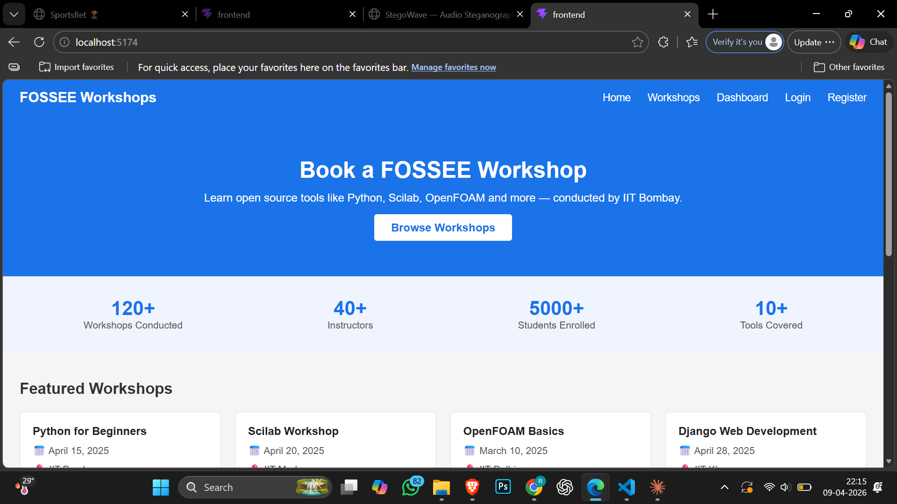
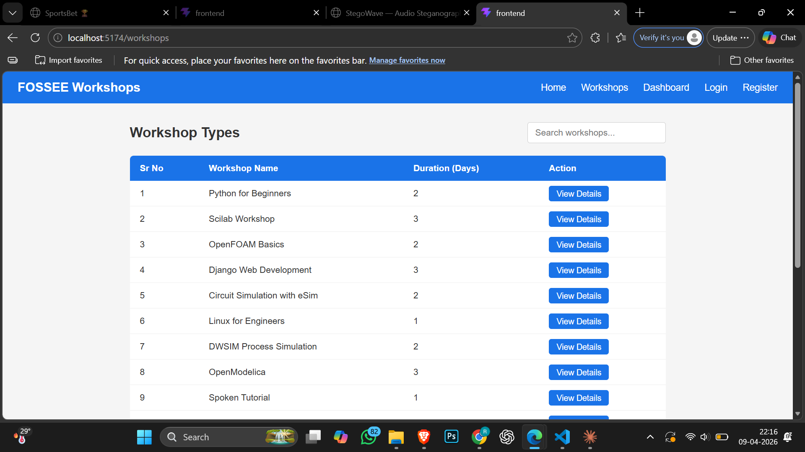
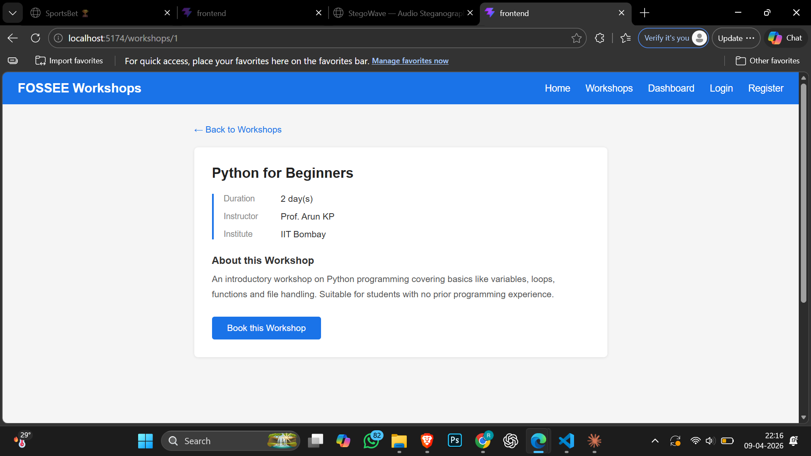
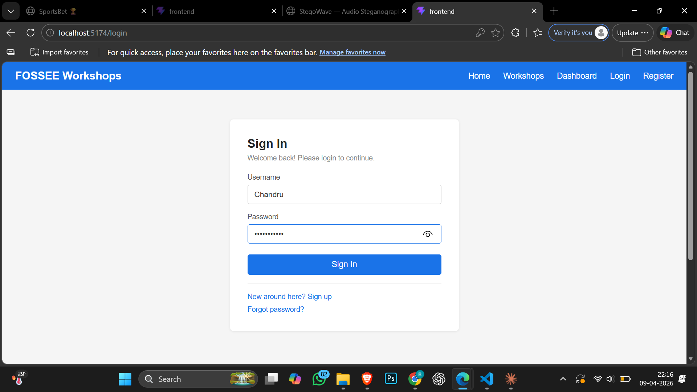
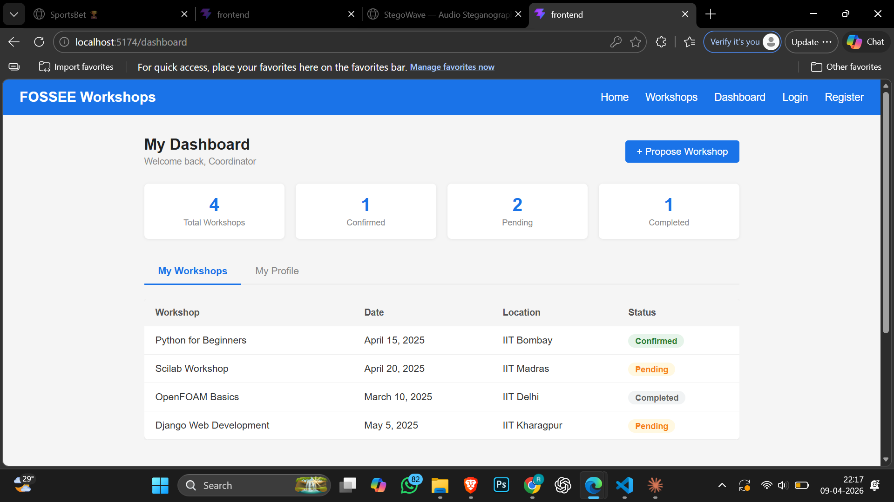

# FOSSEE Workshop Booking — React UI/UX Redesign

A redesigned frontend for the [FOSSEE Workshop Booking](https://github.com/FOSSEE/workshop_booking) system built with React. The original site uses Django with server-side rendered Bootstrap templates. This redesign reimplements the UI as a modern, mobile-first React application.

---

## Pages Redesigned

| Original Django Page | React Page |
|---|---|
| `/login` | Login page with form validation |
| `/register` | Register page with position selection |
| `/types/` | Workshops listing with search |
| `/details/<id>` | Workshop detail page |
| `/status` | Coordinator dashboard with tabs |
| — | Home/landing page (added for better UX) |

---

## Setup Instructions

### Prerequisites
- Node.js (v18 or above)
- npm

### Steps
```bash
# Clone the repository
git clone https://github.com/chandru-rscm/workshop_booking.git
cd workshop_booking/frontend

# Install dependencies
npm install

# Start development server
npm run dev
```

Open `http://localhost:5173` in your browser.

---

## Design Decisions

### What design principles guided your improvements?

The original site had no landing page — users were immediately redirected to login. I added a proper home page with a hero section, stats bar and workshop cards to give first-time visitors context about what the platform is.

For the overall design I followed a few basic principles. Visual hierarchy — important elements like headings and CTAs are larger and higher contrast. Whitespace — enough padding and spacing so pages don't feel cramped, especially on mobile. Consistency — same blue (#1a73e8), same border radius, same font across all pages so it feels like one product.

The workshop list was a plain unstyled table in the original. I kept the table structure (since it matches the data well) but added a colored header, hover states and a search bar so users can find workshops without scrolling.

### How did you ensure responsiveness across devices?

The task says students primarily access this on mobile so I treated mobile as the default. Every page uses CSS flexbox and grid with `flex-wrap` so content stacks naturally on small screens. I used `@media (max-width: 600px)` breakpoints in each component's CSS to handle specific adjustments like stacking the form rows, switching grid to single column and showing the hamburger menu in the navbar.

I tested layouts at 375px (mobile), 768px (tablet) and full desktop width throughout.

### What trade-offs did you make between design and performance?

I avoided any external UI libraries or icon packs to keep the bundle small. No Tailwind, no Bootstrap, no Material UI — just plain CSS per component. This means a bit more CSS code but the page loads faster and there are no unused styles being shipped.

I also used static mock data instead of API calls. Since the Django backend has no REST API endpoints, connecting React directly would require adding Django REST Framework — which is outside the scope of a UI redesign task. The frontend is built to make it easy to swap mock data with real API calls later.

### What was the most challenging part?

Making the table-based workshop list look good on mobile was tricky. Tables don't naturally reflow on small screens. I handled it by wrapping the table in an `overflow-x: auto` container so users can scroll horizontally on small screens without breaking the layout.

The other challenge was keeping the code simple and readable without over-engineering. Since this is a redesign task I focused on clean component structure over advanced patterns.

---

## Note on Backend Integration

The frontend uses mock data to demonstrate the UI. The original Django backend renders HTML templates directly with no REST API. Connecting this React frontend to the backend would require adding Django REST Framework API endpoints — this can be done in a future iteration.

---

## Before & After

### Before — Original Django Site

The original site uses Django with Bootstrap 4 server-side templates.
- No landing page — users land directly on the login screen
- Workshop list is a plain Bootstrap table with no search
- No mobile optimization
- Minimal visual hierarchy

### After — React Redesign

**Home Page**



**Workshops Listing**



**Workshop Detail**



**Login Page**



**Dashboard**



---

## Tech Stack

- React 18
- React Router v6
- Plain CSS (no UI libraries)
- Vite